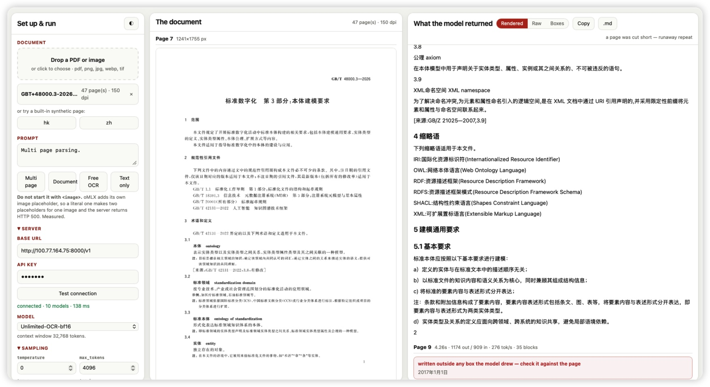

# omlx-ocr-bench

A three-panel workbench for running **any** OCR model served by [oMLX](https://github.com/jundot/omlx)
against documents that come with an answer key — and scoring it on two things that fail
independently: **did it read the words, and did it put them in the right place?**

Point it at a model, click a sample, watch the answer stream in beside the page it came from, and
read the two bars. Then change the model and do it again.



It started as a bench for one model — `baidu/Unlimited-OCR` — and the measurements for that model
are still here, further down, because they are the worked example of what the bench is for.

## Run it

```bash
uv run samples/make_samples.py    # draw the sample pack and its answer keys (do this first)
uv run server.py                  # then open http://127.0.0.1:4700
```

**What you need.** The bench itself is only an HTTP client: any machine with
[uv](https://docs.astral.sh/uv/) will run it, and the server it talks to can be on another
machine. That server is [oMLX](https://github.com/jundot/omlx), which needs an **Apple Silicon
Mac** and enough free unified memory for the checkpoint you load — roughly **8 GB** for an 8-bit
OCR model (~3.7 GiB on disk) or **16 GB** for a bf16 one (~6.2 GiB).

```bash
uv run demo.py samples/legal_deed.pdf --open   # one-shot, writes a static HTML page to out/
uv run test_multipage.py                       # can one request carry several pages?
```

Defaults come from env vars, read in `config.py`: `OMLX_BASE_URL`, `OMLX_API_KEY`,
`OMLX_OCR_MODEL`, `OMLX_OCR_PROMPT`, `OMLX_OCR_DPI`, `OMLX_OCR_FREQUENCY_PENALTY`.

## The three panels

**Left — set up**, with a second tab, **What the settings do**, that explains every knob in plain
words and says what each one was actually measured to do. Drag and drop a PDF or an image, or
click a drawn sample. Then: the prompt, with presets; base URL, API key and a **Test connection**
button that lists every model the server has and shows the chosen one's context window; every
sampling knob oMLX accepts; render DPI; and one request per page or the whole document in one.

**Middle — the document.** Every page as the model sees it, scrolling.

**Right — what came back**, with the score pinned above it. Tokens appear as they arrive and the
panel follows them down until you scroll up to read something. Three views:

* **Rendered** — the answer as a document, with the model's own tables kept as tables.
* **Raw** — exactly what the model emitted, markers and all, dimmed so the words stand out.
* **Boxes** — the page with the model's own layout boxes drawn on it, coloured by kind, with the
  text beside it. Hover a box to highlight its text, and the other way round.

**Copy** and **.md** take the answer out as a markdown file.

Everything goes through the local Python process rather than straight from the browser, because
the oMLX box sets no CORS headers and a browser would refuse the call.

## Any OCR model, not one

The bench reads five output formats and takes whichever a model gives it (`ocr.parse`):

| what the model returns | example | scored on |
|---|---|---|
| `TEXT<\|LOC_160\|><\|LOC_42\|>…` | PaddleOCR-VL | text **and** position |
| `<\|det\|>LABEL [x0,y0,x1,y1]<\|/det\|>` markers | Unlimited-OCR and relatives | text **and** position |
| `<div data-bbox="x0 y0 x1 y1" data-label="…">` | chandra | text **and** position |
| a JSON list of `{bbox, category, text}` | dots.ocr, PaddleOCR-VL, most layout-first models | text **and** position |
| plain markdown, no coordinates | many general VLMs | text only — position reads `n/a` |

Pixel boxes are rescaled to the 0-1000 space the bench works in. A model that returns no
coordinates is not given a fake position score; it simply does not get one.

Each family was also trained on its own exact prompt, and using the wrong one costs more accuracy
than any sampling knob. The prompt presets are one dropdown grouped by model, with the family of
whichever model you have selected floated to the top. That table lives in `ocr.FAMILIES`, in
Python, so the page, the server and the one-shot CLI all read the same list — `ocr.prompt_for()`
is what `demo.py` uses when you give it no prompt.

Some models ignore the prompt completely. chandra returned byte-identical output to five different
ones, which is worth knowing before you spend an afternoon tuning wording.

## The score

Only the drawn samples can be scored, because only they ship an answer key: `make_samples.py`
records every line it draws, with its box, into `samples/truth/`. Your own PDFs still show speed
and everything else — they just cannot show accuracy.

* **Text** — how much of the page came back, weighted by line length, so a correct heading does
  not excuse a lost paragraph.
* **Position** — of the lines it read, how many it placed in the right part of the page. A model
  can transcribe perfectly and still put the whole page in one box, which is useless for cropping
  a signature block or checking where a stamp sits.

Both are deliberately blind to *how* a model groups text — per line, per paragraph, or one blob —
because that is a formatting choice, not a mistake. Feeding an answer key back in as if it were a
model's answer scores 100% / 100%, which is the calibration check.

Alongside them: lines found, graphics marked (a seal, a signature, a logo, a barcode — the model
should mark a region there, not read it), text **invented** (matched nothing on the page), and
**junk** blocks the parser threw away.

## The samples

`uv run samples/make_samples.py` draws the pack and its answer keys:

| file | what it is there to test |
|---|---|
| `legal_deed.pdf` | a deed: numbered clauses, a schedule table, three handwritten signatures, an inked chop and a dry embossed seal, then a near-blank exhibit divider |
| `gov_permit.pdf` | a premises licence: a drawn crest, a two-axis hours table, a conditions box, a figure, a barcode, a council seal |
| `school_transcript.pdf` | a transcript: a grade table, free-text remarks, two signatures, an embossed school seal |
| `commercial_invoice.pdf` | an invoice: a logo, line items, totals, a barcode, a PAID chop |
| `notice_zh.pdf` | Traditional Chinese: a table, a signature, a chop |
| `scan_permit.png`, `scan_notice_zh.png` | the same two pages as bad phone photos — skewed, noisy, lit from one side |

**Every page is drawn from scratch and every name is invented.** No document taken from the web,
no real person, firm, school or authority. That is not only a licence question: a drawn page is
the only kind whose answer key you can actually have.

## Three models, measured head to head

One request per page, 150 dpi, the drawn sample pack, scored against its answer key. Each model
with the prompt and sampling defaults the bench picks for it (`ocr.FAMILIES`).

**Text accuracy:**

| sample | PaddleOCR-VL-1.6 | Unlimited-OCR-bf16 | chandra-ocr-2-8bit |
|---|---|---|---|
| `commercial_invoice.pdf` | **99.6%** | 61.7% | 91.2% |
| `gov_permit.pdf` | **99.5%** | 88.7% | 89.8% |
| `school_transcript.pdf` | **99.3%** | 72.7% | 82.6% |
| `scan_permit.png` | **99.2%** | 84.8% | 89.8% |
| `legal_deed.pdf` | **97.6%** | 74.2% | 72.6% |
| `scan_notice_zh.png` | **97.3%** | 86.6% | 80.1% |
| `notice_zh.pdf` | **97.1%** | 86.3% | 79.8% |

PaddleOCR-VL scored **100% position on all seven**, and read every line of three of them.

**Seconds per document, same run:**

| sample | PaddleOCR-VL | Unlimited-OCR | chandra |
|---|---|---|---|
| `gov_permit.pdf` | **3.7 s** | 4.8 s | 20.3 s |
| `commercial_invoice.pdf` | **3.1 s** | 10.0 s | 18.3 s |
| `notice_zh.pdf` | 2.1 s | **1.9 s** | 10.9 s |
| `legal_deed.pdf` (3 pages) | **9.5 s** | 21.3 s | 27.9 s |

**PaddleOCR-VL-1.6 wins all seven samples and is the fastest on all but one, at 0.9B
parameters.** It read a skewed, noisy phone photo of the permit perfectly — 63 lines of 63 — and
the invoice perfectly too, the page the other two find hardest. It grounds *per line* rather than
per block, so a table comes back cell by cell: more detail than the others give, not less.

The recommendation is not close: **use PaddleOCR-VL.** It is a fraction of the size, the fastest,
and the most accurate on every sample including both Chinese ones. Keep Unlimited-OCR only if its
32K-context multi-page story ever starts working.

### Use the prompt the model documents — it was worth 31 points

PaddleOCR-VL is the recognition half of a two-stage pipeline: a separate layout model
(PP-DocLayoutV2) crops the page, and each crop arrives with its task named. Its
[model card](https://huggingface.co/PaddlePaddle/PaddleOCR-VL-1.6) documents six prompts —
`OCR:`, `Spotting:`, `Table Recognition:`, `Formula Recognition:`, `Chart Recognition:`,
`Seal Recognition:`. Given a whole page rather than a crop, `Spotting:` is the one that reads all
of it and grounds every line.

Measured on the permit, one page, all six plus the two that were guessed at:

| prompt | time | grounded | text | lines found |
|---|---|---|---|---|
| **`Spotting:`** | 3.8 s | **yes** | **99.5%** | **63/63** |
| `Multi page parsing.` (a guess) | 4.2 s | yes | 99.2% | 63/63 |
| `OCR:` | 6.3 s | no | 80.1% | 32/63 |
| `Seal Recognition:` | 2.4 s | no | 70.8% | 20/63 |
| `Chart Recognition:` | 1.8 s | no | 19.2% | 0/63 |
| `Table Recognition:` | 2.3 s | no | 0.0% | 0/63 |
| `Formula Recognition:` | 3.6 s | no | 0.0% | 0/63 |

And across the pack, `Spotting:` against the best guess: the school transcript goes from **68.4%
to 99.3%** and the invoice from 98.7% to **99.6% with every line found**. Every number in the
comparison above uses it.

The lesson generalises, and it is why the prompt presets are grouped by model: for an OCR model
the prompt is not phrasing, it is a mode switch.

### The knob that belongs to the model, not to the bench

`frequency_penalty: 0.8` is what stops Unlimited-OCR repeating a line to the token cap, and it is
measured to cost that model nothing. Applied to PaddleOCR-VL it takes the school transcript from
**68.4% down to 56.0%**.

That is the whole argument for per-model defaults, so the bench now carries them in
`ocr.FAMILIES` and moves the sampling panel when you switch models. It was worth finding: the
first PaddleOCR-VL numbers this bench produced were wrong because it was still applying another
model's medicine.

### What is wrong with `PaddleOCR-VL-1.6`

1. **The prompt is a mode switch, and the wrong one fails quietly.** `Table Recognition:` on a
   page that is mostly prose returns something confident and entirely wrong — 0% against the
   answer key, with no error and no warning. There is nothing in the response to tell you the
   mode was wrong; only an answer key catches it.
2. **It answers in a fifth format** — `TEXT<|LOC_160|><|LOC_42|>…`, the words followed by the
   eight numbers of the surrounding quadrilateral, 0-1000 normalised. The bench reads it now.
3. **It is built to be fed crops, not pages.** Using it whole-page at all is off-label; a real
   pipeline would run PP-DocLayoutV2 first. That it scores 97–99% anyway is the surprise.

### What is wrong with `Unlimited-OCR`

1. **A blank page makes it count.** With nothing to read it emits `1. 2. 3. 4. 5. …` to the token
   cap — 29 s and 8,192 tokens for an empty page. The bench measures the ink and never sends one.
2. **A sparse page makes it loop.** Same failure, less extreme, on a page with a few lines.
   `frequency_penalty: 0.8` fixes it at no measured cost; the knob the model's own pipeline uses,
   `no_repeat_ngram_size`, is accepted by oMLX and ignored.
3. **It writes things that are not on the page.** Every one of 47 pages had a loose line before
   its first marker — on one, a date that appears nowhere in the document. On sparse pages it has
   quoted its own annotation rulebook.
4. **It substitutes characters:** 黄 for 黃, Bramwell for Branwell.
5. **It cannot be sent a multi-page document at all through oMLX** — see below.
6. **It is weak on dense small graphics.** One of five marked on the invoice.

### What is wrong with `chandra-ocr-2`

1. **The prompt reaches it and changes nothing.** chandra publishes its own prompts
   ([`chandra/prompts.py`](https://github.com/datalab-to/chandra/blob/master/chandra/prompts.py)):
   a 2,161-character `OCR_LAYOUT_PROMPT` and a 1,654-character `OCR_PROMPT` that explicitly does
   *not* ask for layout blocks. Sending those, a short paraphrase, or `Describe the weather in
   Paris.` all return the same layout-annotated HTML:

   | prompt | input tokens | output | `data-bbox` present |
   |---|---|---|---|
   | `Describe the weather in Paris.` | 2,165 | 1,716 | yes |
   | chandra's own `OCR_PROMPT` (no layout) | 2,590 | 1,659 | **yes** |
   | chandra's own `OCR_LAYOUT_PROMPT` | 2,738 | 1,625 | yes |
   | `Convert this page to markdown.` | 2,165 | 1,685 | yes |

   The input token count rises with the prompt's length, so oMLX is delivering it — the model
   simply does one thing. Practical consequence: **send the shortest prompt**, because the
   official one costs ~570 extra input tokens a page for identical output.
2. **It is slow, and it is slow at the output end.** 10–28 s a page against 2–22 s, never below
   10 s even on the Chinese notice Unlimited-OCR reads in 1.9 s. It emits ~1,650 tokens for a page
   where Unlimited-OCR emits ~400, and at ~100 tok/s that generation *is* the runtime. Lowering
   the render DPI does not help, which is the useful thing to know:

   | render DPI | image | input tokens | time |
   |---|---|---|---|
   | 96 | 795×1,124 | 1,468 | 16.7 s |
   | 120 | 993×1,405 | 1,957 | 16.8 s |
   | 150 | 1,241×1,756 | 2,738 | 16.7 s |
   | 200 | 1,655×2,341 | 4,389 | 19.7 s |

   Halving the input changes nothing; only pushing past 150 dpi costs. See "Making it faster".
3. **It answers in a fourth format** — `<div data-bbox="62 36 140 100" data-label="Image">` —
   which nothing else emits. The bench reads it now; before it did, chandra scored as if it had
   returned no layout at all. Worth knowing if you write your own client.
4. **It is weaker on Chinese**, by six or seven points on both Chinese samples.
5. **It invents occasionally:** one spurious block on three of the seven samples.

Neither model's problems are oMLX's fault, except the multi-page one, which is entirely oMLX's.

## Making it faster

The one lever that works is **overlapping requests**. oMLX batches what it is given, so a model
that leaves the machine idle between tokens finishes a document sooner when several pages are in
flight. The bench exposes it as **Run → Pages at once**.

| four pages of the deed | 1 at a time | 2 | 4 |
|---|---|---|---|
| `chandra-ocr-2-8bit-mlx` | 31.3 s | 24.1 s | **22.9 s** |
| `Unlimited-OCR-bf16` | 22.5 s | 23.0 s | 23.2 s |

chandra gains about 28%; Unlimited-OCR gains nothing, because it is already saturating the GPU.
End to end through the bench on the three-page deed: **23.5 s → 16.9 s, same 72.6% text score.**
Pages arrive out of order and the page files them by index.

What does **not** work, measured above: lowering the render DPI (the time is in generation, not
perception) and shortening or lengthening the prompt (chandra's output is the same either way,
though the short prompt is cheaper).

Two things left to try, neither tested here:

* **A smaller quant.** `chandra-ocr-2` is only published at 8-bit
  ([`jwindle47/chandra-ocr-2-8bit-mlx`](https://huggingface.co/jwindle47/chandra-ocr-2-8bit-mlx))
  and bf16. The older `chandra` has
  [4-bit](https://huggingface.co/mlx-community/chandra-4bit) and
  [3-bit](https://huggingface.co/mlx-community/chandra-3bit) MLX builds; a 4-bit chandra-ocr-2
  would be the obvious win and does not appear to exist yet.
* **oMLX's speculative decoding.** 0.6.4 ships Lightning MTP, VLM MTP and DFlash, worth roughly
  2× on text models. Whether any applies to this VLM is
  [an open question](https://github.com/jundot/omlx/issues/1779).

## Models worth trying next

PaddleOCR-VL has now been run and is above. The rest have not, and a leaderboard is not your
documents:

| model | size | why | on oMLX |
|---|---|---|---|
| [**PaddleOCR-VL**](https://huggingface.co/PaddlePaddle/PaddleOCR-VL-1.6) | 0.9B | **measured here — wins six of seven samples and is the fastest.** Top of OmniDocBench v1.6 (96.34); 109 languages | **runs on oMLX** |
| [**Qianfan-OCR**](https://huggingface.co/jason1966/Qianfan-OCR-MLX-4bit) | 4B | Baidu's newer one; top of OmniDocBench v1.5 (93.12) and OlmOCR Bench (79.8) | 4-bit MLX conversion published |
| **MinerU2.5-Pro** | — | second on OmniDocBench v1.6 (95.75) | look for a conversion |
| [**dots.ocr / dots.mocr**](https://huggingface.co/blog/ocr-open-models) | 3B | layout-first, emits structured JSON — the format this bench scores best | look for a conversion |
| `chandra-ocr-2-8bit-mlx` | 8B | strong on tables, forms and handwriting across 30+ languages | already runs on oMLX |
| **DeepSeek-OCR**, **olmOCR-2**, **Nanonets-OCR2**, **LightOnOCR** | 1–7B | all credible, all converted for MLX by someone | varies |

The short answer: **try PaddleOCR-VL first.** It is a fraction of the size of what is on the box
now, it tops the newest benchmark, and if it holds up on your own documents the speed difference
will not be small. `chandra-ocr-2` is already loaded and is the free comparison.

---

## What was measured on `Unlimited-OCR`

oMLX 0.6.4, Apple Silicon, September 2026. The long run is a real 47-page Chinese national
standard (GB/T 48000.3—2026), not a sample.

### 1. Skip blank pages before you send them

A blank page is this model's worst case: with nothing to read it **counts** — `1. 2. 3. 4. 5. …` —
until it hits the token cap. 29 s and 8,192 tokens for a page with nothing on it. In a real bundle
— separator sheets, backs of scans, exhibit dividers — that is a large share of a run.

So the bench measures the ink on each page as it renders it (`ocr.ink`) and never sends a page
under 0.08% dark. Measured: a truly blank page renders at **0.0000**, the sparsest real page
tested — four short lines — at **0.0073**. On the 47-page standard this caught pages 2, 45, 46 and
47: four requests never made.

### 2. Set `frequency_penalty: 0.8`

For pages with text but not much, the same loop appears.

| setting | near-empty page | dense page |
|---|---|---|
| none | 17.4 s, 4096 tokens, `finish_reason: length` | 5.1 s, 413 tokens, 14 blocks |
| `repetition_penalty: 1.08` | still runs to the cap | — |
| `repetition_penalty: 1.15` | 0.9 s, 103 tokens, stops | **damages layout**: merges two parties into a bogus one-row `<table>` and loses a word |
| `frequency_penalty: 0.3` / `0.5` | still runs to the cap | — |
| **`frequency_penalty: 0.8`** | **1.5 s, 340 tokens, `finish_reason: stop`** | **byte-identical to none** |

It ends the loop and, on the page that matters, changes nothing. The official pipeline uses
neither — it runs `no_repeat_ngram_size=35`, and **oMLX accepts that and then ignores it**:
byte-identical output with and without. A bug report of its own, below.

Belt and braces: `server.RepeatWatch` abandons an answer once most of its lines are exact repeats.
On the 47-page run it fired on two pages, both genuine loops, and on none of the other 41.

### 3. Do not trust anything written outside a box

**Before the first marker**, on all 47 pages, there is a loose line nobody asked for — sometimes
the running title read badly, on the contents page `2017年1月1日`, **a date nowhere in the
document**, elsewhere `10:00 AM` and `6/1/2000 3-2026`.

**Inside a box, on sparse pages**, it sometimes writes about its own annotation rules instead of
reading: *"The Ground Truth image displays a single, solid horizontal line. According to Rule 2
(UNDERSCORE & LINE RULES)…"* — training-harness text that escaped.

`ocr.parse` labels the first `unboxed`, and a bare counter or a leaked rule `noise`. Both are
shown with a warning and kept out of the exported markdown.

### 4. Which prompt? `Multi page parsing.` — but know the trade

| | `Multi page parsing.` | `document parsing.` |
|---|---|---|
| sparse page 8 | 14.1 s, ran to the cap | 3.8 s, 39 blocks, clean stop |
| sparse page 11 | 14.1 s, ran to the cap | 3.3 s, 25 blocks, clean stop |
| dense page 40 | 5.7 s, **40 blocks** | 2.5 s, **4 blocks**, and it invented a passage about battery cells that is nowhere in this standard |

`document parsing.` is calmer on thin pages and **hallucinates on dense ones**.

### 5. Multi-page in ONE request does NOT work on oMLX

`prompt_tokens` is **identical at 909 whether the request carries one image, two, or three** —
oMLX passes only the first image and silently drops the rest. A "speed-up" measured this way is
not one: the other pages were never read.

The cause is named in the PR that added the model
([#2328](https://github.com/jundot/omlx/pull/2328)): it "reproduces the single-`<image>` multi-page
prompt semantics", i.e. one placeholder however many images arrive. That also explains §6.

The bench keeps that mode (**Run → Requests → all pages, many images**) so the bug is one click to
reproduce, and so it starts working the day oMLX fixes it. It is filed as
[omlx#3740](https://github.com/jundot/omlx/issues/3740); [omlx#2331](https://github.com/jundot/omlx/issues/2331)
asks for the processor settings the model's own multi-page mode needs.

### 5b. Stitching pages into one tall image — how far does it go?

If oMLX only passes the first image, send one image: pages joined top to bottom. The bench does
that under **Requests → 2 pages per image**, and puts each block back on the page it was drawn on
afterwards, so the overlay and the score still work per page.

**So can you stitch a 400-page bundle into one image? No — and not because of the context window.**
Each page carries a unique marker line; stitch N pages and count how many markers come back:

| pages | image | input tokens | time | markers found |
|---|---|---|---|---|
| 1 | 1241×1,755 | 909 | 6.2 s | 1/1 |
| 2 | 1241×3,510 | 1,539 | 5.9 s | **2/2** |
| 4 | 1241×7,020 | 2,589 | 14.2 s | 3/4 |
| 8 | 1241×14,040 | 1,489 | 23.1 s | 7/8 |
| 16 | 1241×28,080 | 2,809 | 119.1 s | 7/16 |
| 32 | 1241×56,160 | 3,799 | 94.2 s | 12/32 |
| 64 | 1241×112,320 | 3,799 | 98.7 s | **3/64**, and it looped |

Look at the token column. It stops growing — 3,799 at 32 pages and 3,799 at 64. **The vision
encoder spends a fixed budget on the picture however tall it is**, so every page you add makes
every page smaller, until the text is below the resolution the model can read. At 64 pages the
image is also 139 megapixels, which trips PIL's decompression-bomb guard.

The ceiling is **two pages**. Four already loses one. A 400-page bundle would be a grey smear.

So the bench batches in pairs rather than pretending otherwise — and whether that is worth it
depends on the model:

| 3-page deed | per page | in pairs |
|---|---|---|
| `Unlimited-OCR-bf16` | 21.3 s, text 74.2% | 19.5 s, text **41.3%**, three pages flagged as loops |
| `chandra-ocr-2-8bit-mlx` | 24.7 s, text 72.6% | 22.8 s, text 69.1%, no loops |

chandra takes a stitched pair in its stride. Unlimited-OCR falls apart on one, because the deed's
third page is the sparse divider and sparseness is what makes that model loop. It ships switched
off for that reason.

### 6. The documented prompt returns HTTP 500

The model card writes it as `<image>Multi page parsing.` That literal `<image>` gives two
placeholders for one image and the template render fails. Send the bare instruction instead.

### 7. Speed

47 pages, one request per page, 150 dpi: **131.7 s**, about **3 s a page**, four skipped as blank
and two cut short as loops. On a single page, against the other OCR model on the same box:
`chandra-ocr-2-8bit-mlx` 10.5 s, `Unlimited-OCR-bf16` **4.7 s** (~126 tok/s).

### 8. Where it slips

It substitutes similar characters: **黄** for **黃** (the simplified variant of a common Hong Kong
surname) and **Bramwell** for **Branwell**. Any name it produces has to be checked against the
document, not trusted.

## Which Unlimited-OCR checkpoint?

| checkpoint | size | why / why not |
|---|---|---|
| [`mlx-community/Unlimited-OCR-bf16`](https://huggingface.co/mlx-community/Unlimited-OCR-bf16) | 6.22 GiB | full precision; what the numbers above were measured on |
| [`mlx-community/Unlimited-OCR-8bit`](https://huggingface.co/mlx-community/Unlimited-OCR-8bit) | 3.66 GiB | if memory is tight. Affine, group size 64 |
| [`mlx-community/Unlimited-OCR-mxfp8`](https://huggingface.co/mlx-community/Unlimited-OCR-mxfp8) | — | same reasoning as 8-bit |
| [`sahilchachra/unlimited-ocr-4bit-mlx`](https://huggingface.co/sahilchachra/unlimited-ocr-4bit-mlx) | — | avoid for documents |

The model already confuses character pairs at **full** precision (§8), and quantisation is exactly
the pressure that makes rare-glyph choices worse. If you want to know rather than guess, the bench
now answers it: same sample, same prompt, swap the model, read the bars.

## Taking PaddleOCR-VL somewhere else

`docs/PADDLEOCR-VL-HANDOFF.md` is a self-contained brief for another project: the documented
prompts, the exact output format with its edge cases, the sampling settings that matter, how to
render the boxes as HTML, and the failure modes to design around. It starts by telling the reader
to verify all of it against the model card and the PaddleOCR repo first.

## The oMLX bugs

`OMLX-BUG-REPORT.md` holds two ready-to-post issues for <https://github.com/jundot/omlx/issues>,
with evidence tables and minimal reproductions:

1. **Only the first image of a multi-image request reaches the model**, and a literal `<image>`
   returns a bare 500 — one cause, two symptoms.
2. **`no_repeat_ngram_size` is accepted and silently ignored.** It should work, or be rejected
   with a 400.

## Layout

| file | what it is |
|---|---|
| `server.py` | the bench: static files, upload, one SSE stream per run, scoring |
| `ui.html` | the three panels and the settings guide. No build step, no dependencies, no CDN |
| `ocr.py` | page rendering, the ink test, the three-format parser |
| `score.py` | text and position scoring against a sample's answer key |
| `config.py` | where the model lives |
| `demo.py` | one-shot: a PDF in, a static HTML page out |
| `test_multipage.py` | the multi-image experiment on its own |
| `samples/make_samples.py` | draws the sample pack and its answer keys |

## Licence and credit

MIT — see `LICENSE`. The models belong to their authors; the MLX conversions are the Hugging Face
community's; oMLX is [jundot/omlx](https://github.com/jundot/omlx). The three-panel idea comes
from [GMfatcat/Unlimited-OCR-Local](https://github.com/GMfatcat/Unlimited-OCR-Local). This repo is
only the bench.
